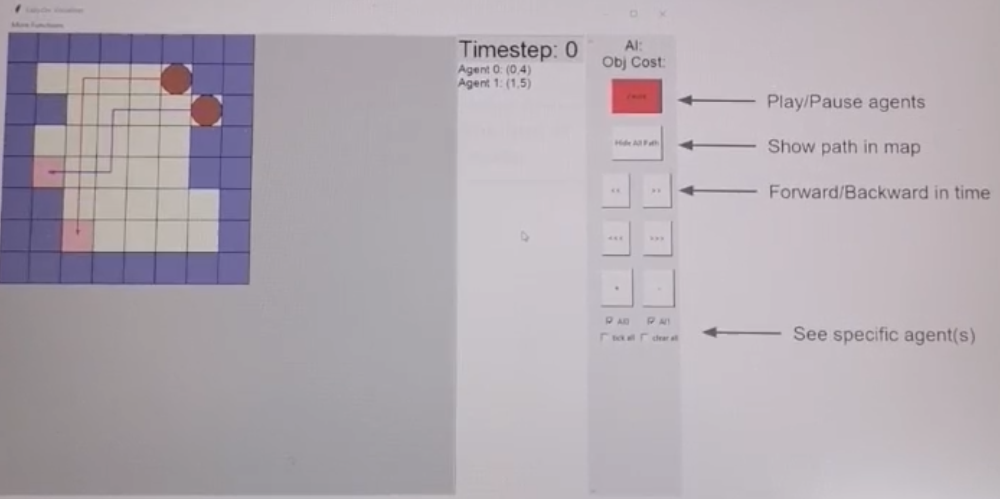

# FIT2082 XMAPF (Explainable Multi-Agent Path Finder in Warehouses)
This is part of a university research project in developing an explanation generation system in robotic warehouses.

## Dependencies & Acknowledgements
- Gange, G., Harabor, D. and Stuckey, P.J. (2021). Lazy CBS: Implicit Conflict-Based Search Using Lazy Clause Generation. In: Proceedings of the International Conference on Automated Planning and Scheduling. [online] International Conference on Automated Planning and Scheduling. pp.155–162. Available at: https://ojs.aaai.org/index.php/ICAPS/article/view/3471 [Accessed 6 Aug. 2021].
- Li, J., Harabor, D., Stuckey, P.J., Ma, H., Gange, G. and Koenig, S. (2021). Pairwise symmetry reasoning for multi-agent path finding search. Artificial Intelligence, [online] 301, p.103574. Available at:https://doi.org/10.1016/j.artint.2021.103574 [Accessed 27 Aug. 2021].

## Software Tools
- [The backend PathFinder](https://github.com/gkgange/lazycbs) is written by my project supervisor Graeme Gange.
- We used [pybind11](https://pybind11.readthedocs.io/en/stable/) in order to connect the Lazy CBS code written in C++ to be called from the GUI's python code.
- The MAPF interface is built using [python's tkinter GUI package](https://docs.python.org/3/library/tkinter.html).

## Datasets
- The [MovingAI dataset](https://movingai.com/benchmarks/mapf/index.html) has a lot of scenarios and maps that can be passed in as arguments to the python GUI interface.
- The map files from MovingAI have to be converted to .ecbs files using [this script](https://github.com/AppleGamer22/FIT2082/blob/master/lazycbs/scripts/map-conv.py).

## Run the program
- Install the [pybind11](https://pybind11.readthedocs.io/en/stable/installing.html) tool.
- Generate the mapf solution following the instruction from this repository [the lazycbs codebase](https://github.com/AppleGamer22/FIT2082). 
- Save the output to [solution_name.txt] to be passed to the front-end GUI.
- Run in Linux： python3 run.py [solution_name.txt] [map_name.ecbs] [agent number]
- Run in Windows/Mac:  python run.py [solution_name.txt] [map_name.ecbs] [agent number] or double click run.py

### Functions
  - Play/pause the agents
  - Forward/Backward in time
  - Show path details
  - See specific agent(s) movement in the scenario
  - Inspect agent's position in its lifespan (More Functions->Agent Detail)
  - **Ask Questions** (Linux only, More Functions → Ask Questions)
---

### Examples

| Question                                           | Agent | loc1         | loc2         | Time  | Cost |
| -------------------------------------------------- | :---: | :----------: | :----------: | :---: | ---: |
| Is there a new path for agent 1 with time cost 7?  |   1   |              |              |       |  7   |
| New path if agent 0 avoids location (3,4)?         |   0   |   3,4       | -1 (forbid)  |       |      |
| New path if agent 1 passes through (3,4) and (3,5)?|   1   |   3,4       |    3,5       |       |      |

### Run Screenshots

